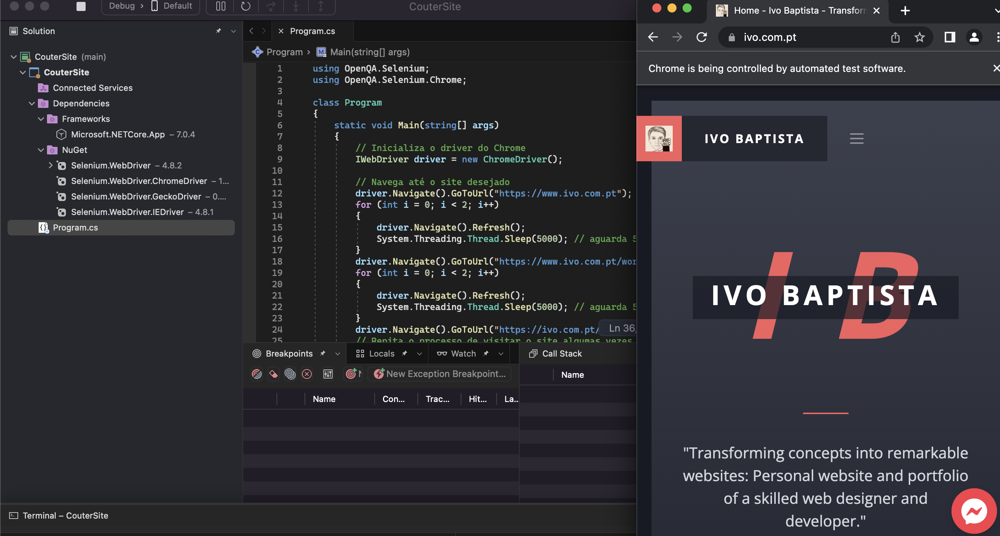

<h1 align="center">
    
</h1>

📌 Minha pagina do CouterSite
------------------
Este programa utiliza as bibliotecas Selenium WebDriver e ChromeDriver para iniciar uma nova instância do navegador Chrome e navegar até um site específico (neste exemplo, "https://www.ivo.com.pt"). Em seguida, ele usa um loop for para atualizar a página do site 2 vezes com um intervalo de 5 segundos entre cada atualização. Por fim, o driver do Chrome é fechado para encerrar o programa.

Para executar basta abrir o projeto no visual studio com o <strong>selenium web drive</strong> instalado e compativel com o google chrome 
 

 

🔧 Tecnologias utilizadas:
------------------

- <strong>C++</strong>
- <strong>visual Studio</strong>
- <strong>MacOS</strong>

💬 Fale comigo
------------------
[*Entre em contato comigo*](https://www.linkedin.com/in/ivo-baptista-3712144/)

